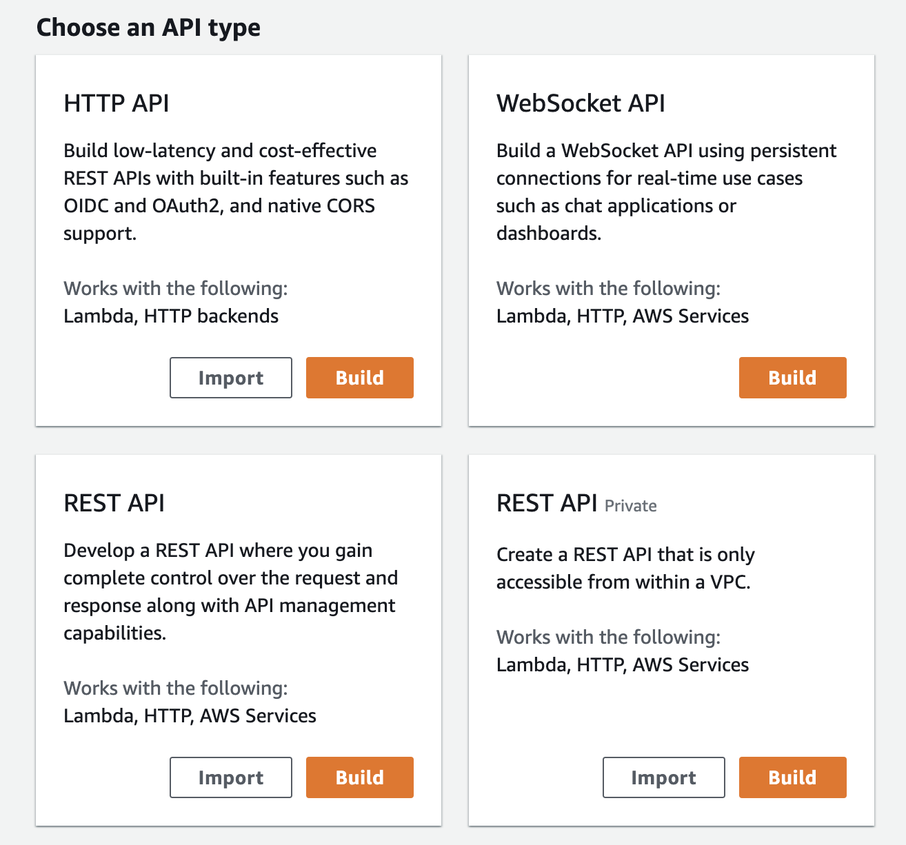

# AWS API Gateway

- [AWS API Gateway](#aws-api-gateway)
  - [What is an API Gateway?](#what-is-an-api-gateway)
  - [What is AWS API Gateway?](#what-is-aws-api-gateway)
  - [API types](#api-types)
  - [HTTP API](#http-api)
  - [REST API](#rest-api)
  - [Choosing between AWS HTTP API and REST API](#choosing-between-aws-http-api-and-rest-api)
  - [Main building blocks](#main-building-blocks)
    - [Resources](#resources)
    - [Methods](#methods)
    - [Integrations](#integrations)
    - [Stages](#stages)
    - [Lambda function integration](#lambda-function-integration)
  - [Securing your APIs](#securing-your-apis)
  - [References](#references)

## What is an API Gateway?

An application usually has the goal of getting some input data, processing it and giving some output. This flow happens via application integrations with other systems that can be an user interface or a database.

One important integration pattern integrating systems and user interfaces via an [API Gateway](https://microservices.io/patterns/apigateway.html).

[API Gateway pattern](https://microservices.io/patterns/apigateway.html)

## What is AWS API Gateway?

Amazon API Gateway is a fully managed service that makes it easy for developers to create, publish, maintain, monitor, and secure APIs at any scale. 

It offers a comprehensive platform for API management. API Gateway allows you to process hundreds of thousands of concurrent API calls and handles traffic management, authorisation and access control, monitoring, and API version management.

## API types

- **REST APIs**
  -  ***HTTP APIs*** are the best choice for building APIs that only require API proxy functionality.
  -  ***REST APIs***: If your APIs require API proxy functionality and API management features in a single solution, API Gateway also offers REST APIs.
- **Websocket APIs**

## HTTP API

HTTP APIs enable you to create RESTful APIs with lower latency and lower cost than REST APIs.

You can use HTTP APIs to send requests to AWS Lambda functions or to any routable HTTP endpoint.

HTTP APIs support **OpenID Connect** and **OAuth 2.0** authorization. They come with built-in support for cross-origin resource sharing (CORS) and automatic deployments.

## REST API

A REST API in API Gateway is a collection of **resources** and **methods** that are integrated with backend HTTP endpoints, Lambda functions, or other AWS services. 

API Gateway REST APIs use a **request/response model** where a client sends a request to a service and the service responds back **synchronously**. This kind of model is suitable for many different kinds of applications that depend on synchronous communication.

## Choosing between AWS HTTP API and REST API

https://docs.aws.amazon.com/apigateway/latest/developerguide/http-api-vs-rest.html

## Main building blocks

### Resources

This is an API resource, usually defined in terms of business. For example `/pets` or `/accounts`.

It may contain `path parameters`, for example `/accounts/{id}`.

For proxy integration you can yet set `{proxy+}`, to pass the entire path to the backend service.

### Methods

These are the regular HTTP methods available, plus the method `ANY` that indicates any HTTP method and is usually used for proxy integration (forwarding requests to some backend).

- ANY
- DELETE
- HEAD
- GET
- PUT
- POST
- PATCH
- OPTIONS

### Integrations

An API gateway can integrate with several services and it varies per API type:
  
HTTP API:
- Lambda, HTTP backends

WebSocket API:
- Lambda, HTTP, AWS Services

REST API:
- Lambda, HTTP, AWS Services, Mock

`Mock` is a way of returning fixed responses and it is good for  testing purposes.

`AWS Services` is a way of integrating API Gateway directly with several AWS services, using it as a proxy for `DynamoDB` and `S3` for example.
Check [this example](https://aws.amazon.com/blogs/compute/using-amazon-api-gateway-as-a-proxy-for-dynamodb/) of API Gateway integrating directly with DynamoDB.

### Stages

Stages are environments or versions of your deployed API. Usually they vary per environment, so you would have a stage called `dev` and `prod`, or per version like `v1`, `v2`.

You can create up to 10 stages (default limit) per API.

### Lambda function integration

You can integrate an API method with a Lambda function using Lambda proxy integration or Lambda non-proxy (custom) integration.

In `Lambda proxy integration`, the setup is simple. If your API does not require content encoding or caching, you only need to set the integration's HTTP method to POST, the integration endpoint URI to the ARN of the Lambda function invocation action of a specific Lambda function, and the credential to an IAM role with permissions to allow API Gateway to call the Lambda function on your behalf.

In `Lambda non-proxy integration`, in addition to the proxy integration setup steps, you also specify how the incoming request data is mapped to the integration request and how the resulting integration response data is mapped to the method response.

## Securing your APIs

For Authentication and Authorization you can use:

- **Custom Authorizers**
  - **Cognito User Pool**: you can configure a pool of users associated with this API.
  - **Lambda**: You can have a Lambda running to validate if the requester is authorised to call the API endpoint.

For distributing your API, the access control can be:
- **Open to the world:** Don’t add any authorization or authentication requirements. Any user can invoke your function with an HTTP call.
- **IAM**: Use IAM permissions to authorize access to your API. Users are required to include authentication signatures in their HTTP calls.
- **API Keys**: Simple method of granting access to clients

To set up API keys, do the following:

1. Define an usage plan for the stage `X`.
2. Create or import an API key for the API in a region and associate it to the usage plan.
3. Configure API methods to require an API key.
4. Deploy the API in the stage `X`.

## References

- [Tutorial: Build a Hello World REST API with Lambda proxy integration](https://docs.aws.amazon.com/apigateway/latest/developerguide/api-gateway-create-api-as-simple-proxy-for-lambda.html)